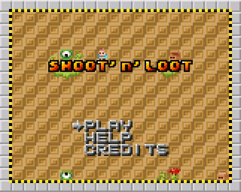
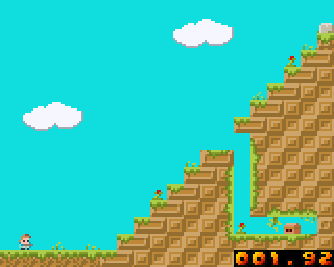
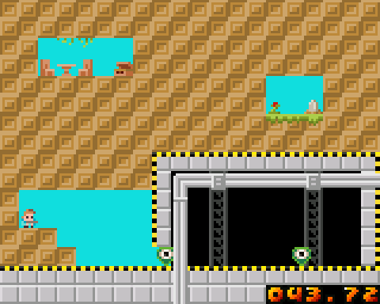
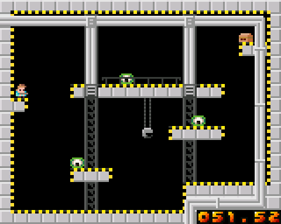
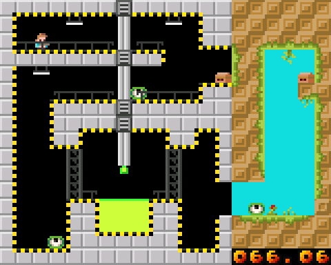
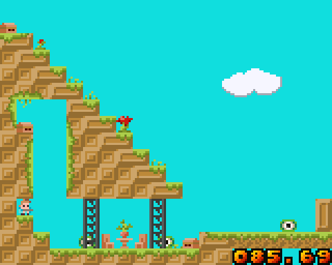
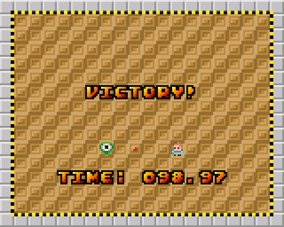

# shoot-n-loot
A little platform and shoot game for the [AdaFruit PyGamer](https://www.adafruit.com/product/4242).

If you have PyGamer:
 - Connect the PyGamer to your computer with a good USB cable
 - Turn on the PyGamer
 - Double-click the reset button to enable the UF2 bootloader
 - A `PYGAMERBOOT` disk drive should appear on your computer
 - Download this file: [shoot_n_loot.uf2](https://github.com/Fabien-Chouteau/shoot-n-loot/releases/download/v0.1.0/shoot_n_loot.uf2)
 - Drag and drop `shoot_n_loot.uf2` in the `PYGAMERBOOT` disk drive
 - After the short time, the PyGamer should reboot and the game will start

